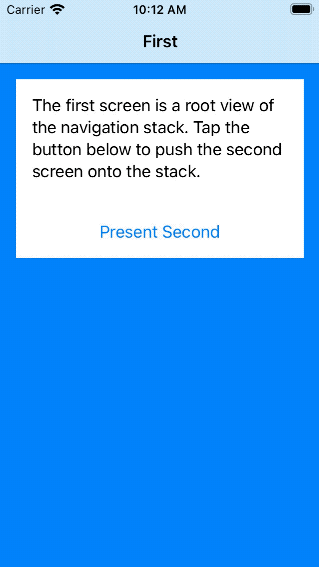

# SwiftUI Navigation with Composable Architecture

## 📝 Description

This is a demo project that shows how to implement navigation in SwiftUI iOS application using [Swift Composable Architecture](https://github.com/pointfreeco/swift-composable-architecture). It uses `NavigationLink` to push screens onto the navigation stack. App state is managed using Composable Architecture. It also contains logic responsible for handling long-living effects and dismissing the stack to the root view (pop-to-root).

Solutions used in this project are described in the article: [Thoughts on SwiftUI navigation](https://github.com/darrarski/darrarski/blob/main/2021/04/Thoughts-on-SwiftUI-navigation/README.md).

|Navigation in demo app|
|:-:|
||

## 🛠 Tech stack

- [Xcode](https://developer.apple.com/xcode/) v12.4
- [Swift](https://swift.org/) v5.3
- [iOS](https://www.apple.com/pl/ios/) v14.4
- [ComposableArchitecture](https://github.com/pointfreeco/swift-composable-architecture) v0.17.0

The project contains unit and snapshot tests. Reference images for snapshot tests were recorded using iPhone 12 simulator.

## ☕️ Do you like the project?

## 📄 License

Copyright © 2021 Dariusz Rybicki Darrarski

License: [MIT](LICENSE)
